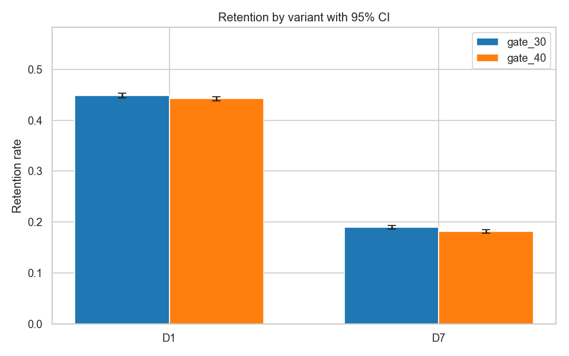
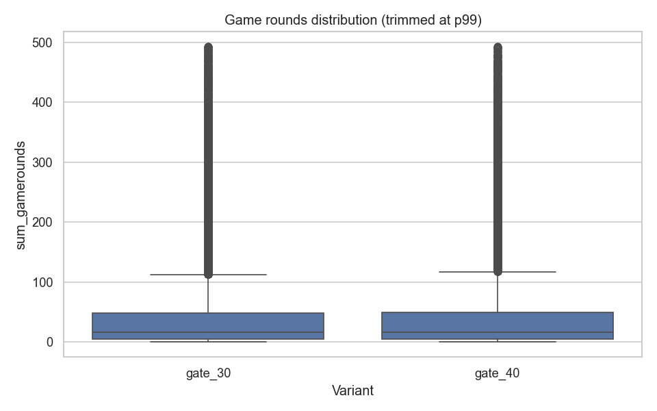
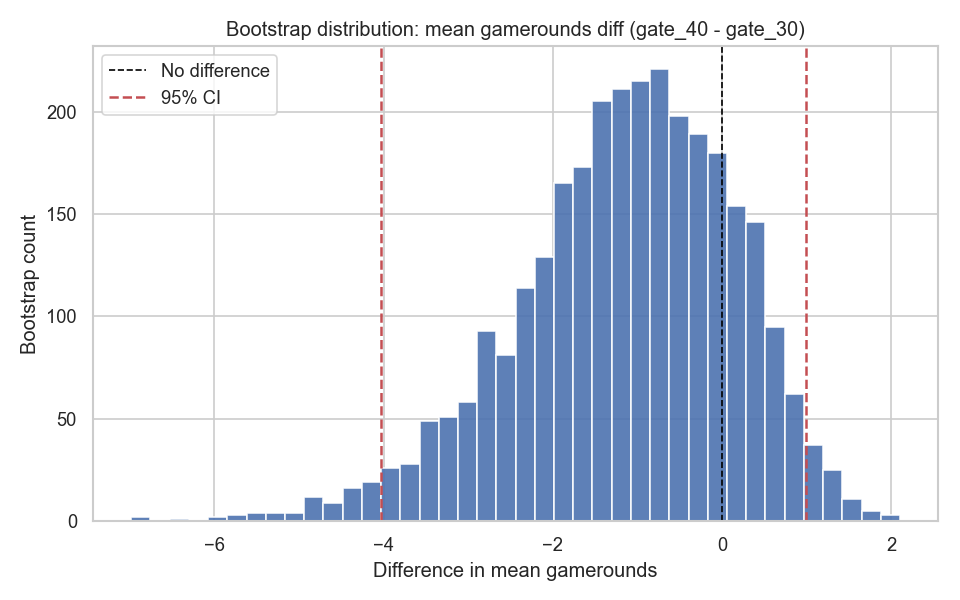
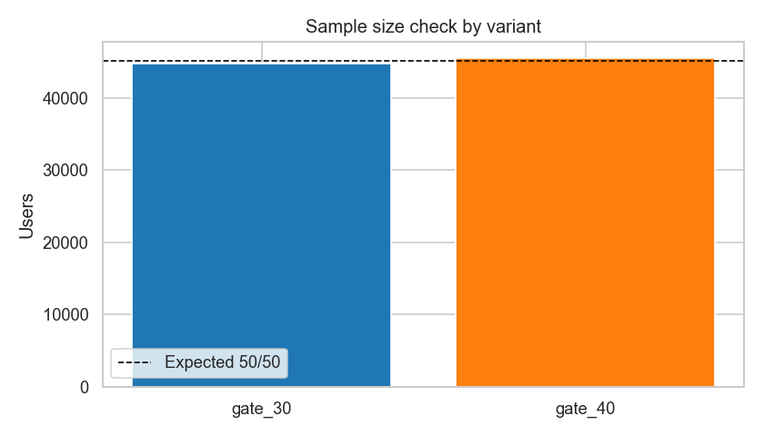

# Cookie Cats A/B Experiment Review

## Executive Summary
This project analyzes a Cookie Cats A/B experiment testing whether moving the first game gate from level 30 to level 40 changes player retention and engagement.

**Experiment**
- Control: `gate_30`
- Treatment: `gate_40`
- Primary metric: Day-7 retention

**Key Findings**
- Day-7 retention decreased by **0.82 percentage points** (95% CI **[-1.33 pp, -0.31 pp]**, p = **0.0016**)
- Day-1 retention also decreased by **0.59 percentage points** (p = 0.0744)
- Engagement metrics did not show a robust upside for `gate_40`

**Recommendation**
- **Do not move the gate to level 40**
- Keep `gate_30` and test alternative pacing designs in follow-up experiments

## Business Context
Cookie Cats uses level gates to shape progression pace. Moving the first gate later can increase short-term flow but may weaken long-term motivation loops. The product question is whether level-40 gating improves retention enough to justify rollout.

## Experiment Design
- **Unit of randomization:** `userid`
- **Variants:** `gate_30` (control) and `gate_40` (treatment)
- **Analysis window:** D0-D7 after first exposure
- **Metrics:** `retention_7` (primary), `retention_1`, `sum_gamerounds` (secondary)
- **Reproducibility:**
  - `pip install -r requirements.txt`
  - `python src/analysis.py`
- **Artifacts:** `reports/report.md`, `figures/*.png`

## Data Validation
- **Sample sizes:** `gate_30` = 44,700, `gate_40` = 45,489
- **SRM check:** chi2 = 6.9024, p = 0.0086 (allocation mismatch signal)
- **Randomization proxy checks:**
  - User ID parity balance p = 0.1217
  - User ID last-digit balance p = 0.7961
- **Distribution check:** gamerounds KS p = 0.0171 (distributional difference exists; heavy-tail handling is required)
- **Interpretation:** results are directionally consistent, but SRM means effect interpretation should include implementation-risk caution.

## Statistical Analysis
- **Binary outcomes:** two-sample proportion z-test with 95% CI
- **Engagement:** Mann-Whitney U test and 1% trimmed mean robustness check
- **Bootstrap:** treatment-control mean difference bootstrap distribution with 95% CI
- **Power analysis:** alpha = 0.05, power = 0.80, baseline from control D7 retention

## Results
- **D7 retention:** -0.82 pp, 95% CI [-1.33 pp, -0.31 pp], p = 0.0016
- **D1 retention:** -0.59 pp, 95% CI [-1.24 pp, 0.06 pp], p = 0.0744
- **Gamerounds mean difference:** -1.16 (treatment - control)
- **Mann-Whitney p-value:** 0.0502
- **Trimmed mean (1%):** 45.11 vs 44.83
- **Bootstrap CI (mean diff):** [-4.03, 0.99]
- **Power / MDE:**
  - Current-sample D7 MDE is about 0.73 pp
  - Required n/group for +0.50 pp detection: ~96,714
  - Required n/group for +1.00 pp detection: ~24,178

## Product Recommendation
- **Decision:** Rollback / do not ship `gate_40`
- **Why:** primary metric worsens materially and significantly, with no compensating engagement upside
- **Product thinking:** if a future variant improves engagement but hurts retention, prioritize long-term retention unless engagement gain maps to proven monetization or LTV lift
- **Execution note:** resolve SRM cause before relaunching any follow-up experiment

## Limitations
- Dataset is limited to D0-D7; no long-run retention, revenue, or LTV
- No segmentation by cohort, platform, geo, or acquisition channel
- Covariate balance uses available proxies, not full pre-treatment covariates
- Multiple-comparison correction is not applied across all potential cuts

## Next Experiments
- Test pacing alternatives that preserve challenge while reducing friction spikes
- Run segmented experiments by early-skill proxies and acquisition cohorts
- Add guardrails for monetization and frustration signals
- Pre-register SRM monitoring and assignment instrumentation checks

## Key Visuals
### Retention Comparison (with CI)

Treatment underperforms on both D1 and D7 retention, with the clearest negative signal on D7.

### Gamerounds Distribution (Heavy-Tail)

The engagement distribution is heavy-tailed; robust tests and trimmed means are required to avoid being driven by extreme users.

### Bootstrap Difference Distribution

The bootstrap distribution for gamerounds difference spans zero, supporting the conclusion that engagement upside is not robust.

### SRM Check

Group sizes deviate from perfect 50/50 allocation, so conclusions should be interpreted with experiment-validity caution.

